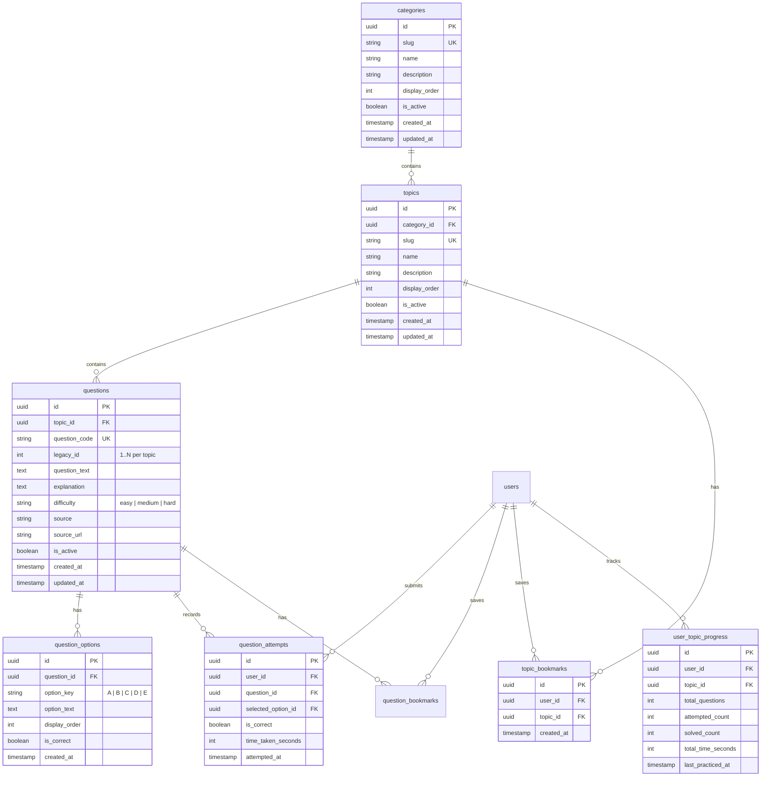

# 📚 SkillsCatalyst Question Bank & Placement Prep Database Architecture

## 1. Overview
The SkillsCatalyst Question Bank has been migrated from static frontend data files to **Supabase PostgreSQL** using a normalized, secure, and production-ready relational architecture.

* **Categories**: 3 (`Quantitative Aptitude`, `Logical Reasoning`, `Verbal Ability`)
* **Topics**: 44
* **Questions**: 910
* **Question Options**: 3,843
* **Security Model**: Client NEVER receives `is_correct` before submitting an attempt. Server-side validation via PostgreSQL stored procedures.

---

## 2. Entity-Relationship Diagram (ERD)



---

## 3. Database Tables

### 1. `categories`
Top-level learning categories (`quantitative-aptitude`, `logical-reasoning`, `verbal-ability`).

### 2. `topics`
Sub-domains under each category (e.g. `percentages`, `problems-on-trains`, `blood-relations`, `reading-comprehension`).

### 3. `questions`
Question stems with explanations, source metadata, and difficulty levels. Maintains:
- `question_code`: Deterministic identifier (e.g. `QA_PROBLEMS_ON_TRAINS_001`).
- `legacy_id`: Integer 1..N per topic, ensuring zero regression with LocalStorage student attempts.

### 4. `question_options`
Individual multiple-choice options (`A`, `B`, `C`, `D`, `E`). Stores `is_correct` on the server.

### 5. `question_attempts`
Records every student attempt with selected option, correctness, and time spent.

### 6. `user_topic_progress`
Aggregated mastery statistics per user per topic (`total_questions`, `attempted_count`, `solved_count`, `total_time_seconds`).

### 7. `topic_bookmarks` & `question_bookmarks`
Cross-device bookmarks with unique constraints on `(user_id, topic_id)` and `(user_id, question_id)`.

---

## 4. Security & Row-Level Security (RLS) Policies

1. **Answer Protection (Zero Client Leakage)**:
   - Client calls `get_topic_questions(p_topic_id)` RPC to fetch questions. This stored procedure omits `is_correct` entirely.
   - Answer submission is handled by `submit_question_attempt(p_question_id, p_selected_option_id, p_time_taken_seconds)` which executes with `SECURITY DEFINER` privileges, validates the selection on PostgreSQL, records the attempt, updates topic progress, and returns `{ is_correct, correct_option_id, explanation }`.
2. **RLS Policies**:
   - `categories`, `topics`, `questions`, `question_options`: Public read for `is_active = true`.
   - `question_attempts`, `user_topic_progress`, `topic_bookmarks`: Strictly restricted to `auth.uid() = user_id`.

---

## 5. Migration & Seeding Commands

### Apply Migration SQL:
```bash
npx supabase db query --linked --file supabase/migrations/20261003_create_question_bank_system.sql
```

### Run Idempotent Batch Seed:
```bash
python backend/scripts/seed_question_bank.py
```

### Run Automated Audit & Validation Test Suite:
```bash
python backend/scripts/test_question_bank_system.py
```

---

## 6. Frontend Data Access Architecture (`frontend/lib/aptitude/`)

- `categories.ts`: `getCategories()`
- `topics.ts`: `getTopics()`, `getAllTopicsMap()`
- `questions.ts`: `getQuestionsByTopicId()`, `getQuestionsByTopicName()`, `toLegacyQuestions()`
- `attempts.ts`: `submitQuestionAttempt()`, `recordLegacyAttempt()`, `getLegacyTopicAttempts()`
- `progress.ts`: `getUserTopicProgress()`
- `bookmarks.ts`: `getUserTopicBookmarks()`, `toggleTopicBookmark()`
- `cache/aptitudeCache.ts`: In-memory TTL client caching to prevent redundant database queries.
